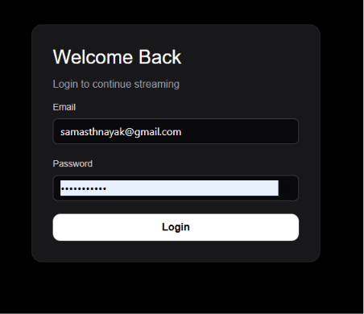
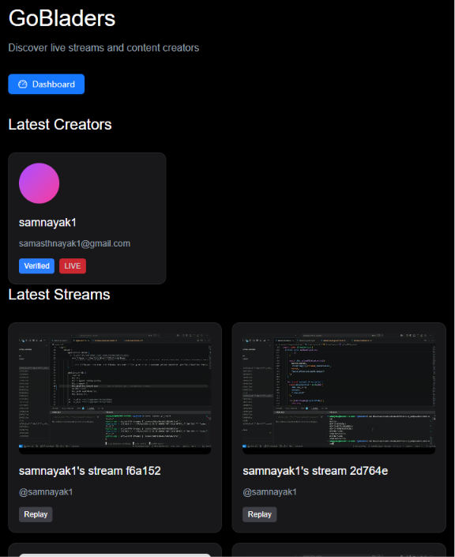
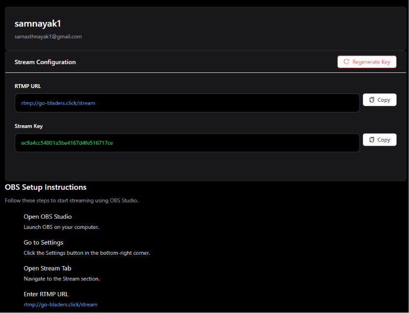
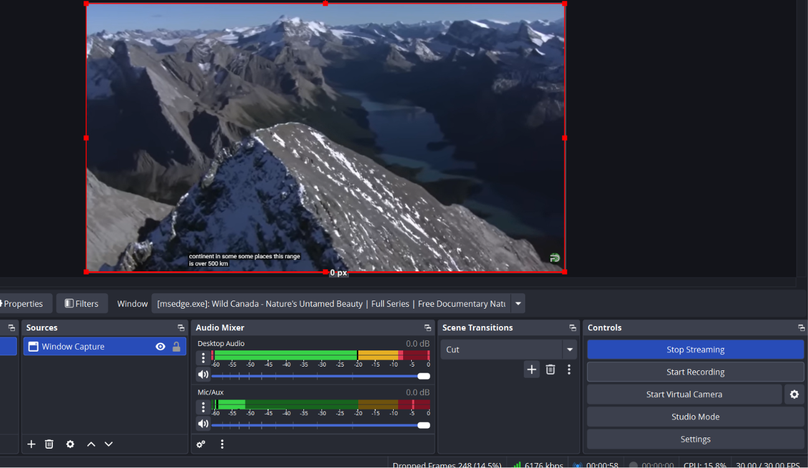
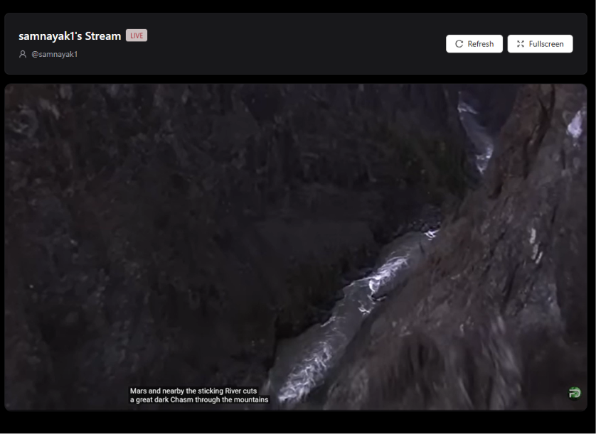

# GoBladers Streaming Platform

A live streaming platform using HLS (HTTP Live Streaming) with adaptive bitrate streaming for optimal viewing experience.

**Tech Stack:**
- **Streaming Protocol:** HLS (HTTP Live Streaming)
- **Transcoding:** FFmpeg
- **RTMP Server:** nginx-rtmp
- **Frontend:** React/Next.js
- **Backend:** Node.js/Express
- **Containerization:** Docker & Docker Compose

---

## Installation

### Prerequisites

- Docker
- Docker Compose

### Setup

1. Clone the repository and navigate to the project directory

2. Set proper permissions for HLS and encryption keys:

```bash
sudo chmod -R 777 ./hls
sudo chmod -R 755 ./keys
```

3. Start the services:

```bash
docker compose up --build
```

---

## Getting Started

### Authentication


*User login page for accessing the streaming platform*

### Home & Discovery


*Discover latest content creators and live streams*


### Streaming Setup

#### Stream Configuration


*Streamer dashboard showing RTMP URL and Stream Key for broadcast setup*

#### Broadcasting with OBS


*OBS Studio configured for streaming with audio mixer and scene controls*

### Live Viewing


*Watch live streams with viewer statistics and quality controls*

---

## How It Works

The streaming pipeline follows this architecture:

```
Step 1: Streamer Setup (OBS)
        ↓
Step 2: Push Stream via RTMP
        rtmp://localhost:1935/stream/<streamKey>
        ↓
Step 3: nginx-rtmp Validation
        Validates via /auth/publish endpoint
        ↓
Step 4: FFmpeg Transcoding
        Transcodes to 5 quality levels for adaptive streaming
        ↓
Step 5: HLS File Generation
        Writes HLS segments (.ts files) to /opt/data/hls
        ↓
Step 6: Viewer Access
        http://localhost:8080/live/<streamKey>.m3u8
```

---

## Video Streaming Concepts


## Resources

For deeper learning on streaming concepts, check out [Ivaylo Pavlov's YouTube channel](https://www.youtube.com/@IvayloPavlov) which covers video fundamentals and streaming protocols in detail.

---

### Video Fundamentals

#### Resolution
The number of pixels in a single video frame.

- **Full HD:** 1080p (1920 × 1080)
- **Ultra HD:** 4K (3840 × 2160)

#### Frame Rate
The number of images displayed per second.

- **Cinema:** 24fps
- **YouTube Standard:** 30fps

#### Codec
Converts video frames into binary data.

Examples: `AV1`, `AVC (H.264)`, `HEVC (H.265)`, `VP9`

#### Container
A file format that bundles video, audio, and subtitles together.

Examples: `.mp4`, `.mkv`, `.m3u8`

#### Bitrate
The amount of data used per second of video.

**Per Stream (Single Viewer):**

| Variant | Video Bitrate | Audio Bitrate | Total |
|---------|---------------|---------------|-------|
| 480p    | 1000k         | 128k          | ~1.1 Mbps |
| 240p    | 400k          | 128k          | ~0.5 Mbps |

**Bandwidth Scaling:**
- 1 viewer = 1.1 Mbps
- 100 viewers = 110 Mbps
- 1000 viewers = 1.1 Gbps

**Storage Requirements:**
- 480p: 1.128 Mbps × 3600s = ~0.51 GB/hr
- 240p: 0.264 Mbps × 3600s = ~0.12 GB/hr
- Total all variants = ~0.63 GB/hr per stream

For 10 streamers each streaming 2 hours/day:
```
10 × 2 × 0.63 = ~12.6 GB/day
12.6 × 30 = ~360 TB/month
```

**Bitrate Formula:**
```
Bitrate = Frame Rate × Duration × Resolution / Codec Efficiency
```

#### Group of Pictures (GOP)
Keyframes are full images. The GOP size is the distance between keyframes. For adaptive bitrate switching, keyframes must be aligned across all quality variants.

#### .ts Files (MPEG-2 Transport Stream)
HLS video is broken into small chunks called segments, each containing its own timing information (Program Clock Reference):

- `hls_fragment 5` means each segment is 5 seconds
- `hls_playlist_length 3600` keeps 1 hour of segments in the playlist
- Maximum segments in playlist: 3600 / 5 = 720 segments

Example segment structure:
```
segment_001.ts
segment_002.ts
segment_003.ts
```

---

## HLS (HTTP Live Streaming)

HLS uses **Adaptive Bitrate Streaming (ABR)** to dynamically adjust video quality based on the viewer's network conditions and device capabilities, ensuring smooth playback with minimal buffering.

### How Adaptive Bitrate Streaming Works

1. The client downloads a manifest file describing available streams and their bitrates
2. On startup, the client requests the lowest bitrate stream
3. If network throughput exceeds the current bitrate, the client requests a higher quality segment
4. If network conditions deteriorate, the client drops to a lower quality segment
5. An ABR algorithm in the client makes these decisions in real time

### Master Playlist (`master.m3u8`)

The master playlist describes all available quality variants:

```m3u8
#EXTM3U
#EXT-X-STREAM-INF:BANDWIDTH=800000,RESOLUTION=640x360,FRAME_RATE=30.00,CODECS=avc1
low/index.m3u8
#EXT-X-STREAM-INF:BANDWIDTH=1500000,RESOLUTION=854x480
mid/index.m3u8
#EXT-X-STREAM-INF:BANDWIDTH=3000000,RESOLUTION=1280x720
high/index.m3u8
```

### Variant Playlist (`index.m3u8`)

Each quality level has its own variant playlist containing segment references:

```m3u8
#EXTM3U
#EXT-X-VERSION:3
#EXT-X-TARGETDURATION:10
#EXT-X-MEDIA-SEQUENCE:124

#EXTINF:10.000,
segment_124.ts
#EXTINF:10.000,
segment_125.ts
#EXTINF:10.000,
segment_126.ts

#EXT-X-ENDLIST
```

### .bak Files
nginx-rtmp creates `.bak` files temporarily when updating HLS playlists as a safe-write pattern:

1. nginx-rtmp wants to update `index.m3u8`
2. Renames existing `index.m3u8` → `index.m3u8.bak` (backup)
3. Writes the new `index.m3u8`
4. Deletes `index.m3u8.bak`

If something goes wrong during the write, the `.bak` file acts as a fallback.

---

## FFmpeg Transcoding

For each quality variant, FFmpeg applies the following settings:

| Flag | Value | Description |
|------|-------|-------------|
| `-c:v` | `libx264` | Video codec — encodes to H.264, the industry standard for web and mobile |
| `-c:a` | `libfdk_aac` | Audio codec — encodes to AAC |
| `-b:v` | e.g. `2500k` | Video bitrate — higher means more detail (720p uses 2500k, 240p uses 200k) |
| `-b:a` | e.g. `128k` | Audio bitrate |
| `-s` | e.g. `1280x720` | Resolution of the output video |
| `-g` | `30` | GOP size — a keyframe every 30 frames. At 30fps this is every 1 second |
| `-r` | `30` | Frame rate |
| `-preset` | `superfast` | Prioritizes encoding speed over file size — critical for live streaming to prevent lag |

---

